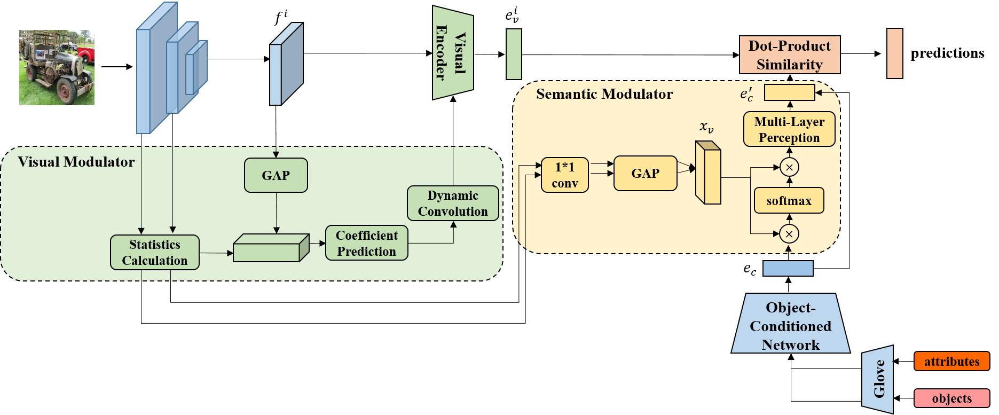

# Dynamic-RCZSL
This is the PyTorch code of our AAAI 2024 paper - A Dynamic Learning Method towards Realistic Compositional Zero-Shot Learning.
We provide the training and testing code implementation of our method on the MIT-States-RCZSL dataset.

<p align="center">
  
</p>

If you find this code helpful, please cite
```
@inproceedings{xiaoming2024dynamic,
  title={A Dynamic Learning Method towards Realistic Compositional Zero-Shot Learning},
  author={Xiaoming, Hu and Zilei, Wang},
  booktitle={Proceedings of the AAAI Conference on Artificial Intelligence},
  year={2024}
}

```
## Acknowledgment
We thank the following repos providing helpful components/functions in our work.

- [OADis](https://github.com/nirat1606/OADis)
